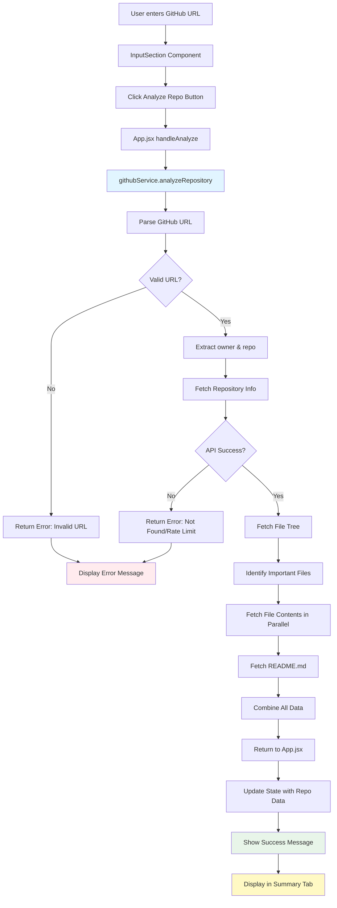
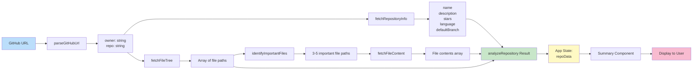
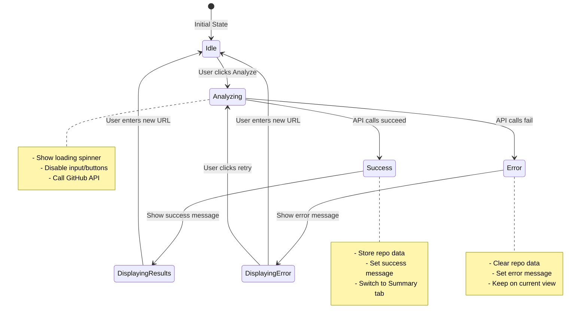
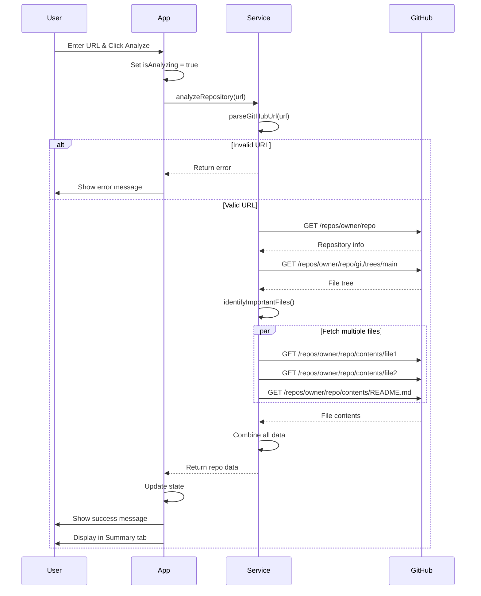
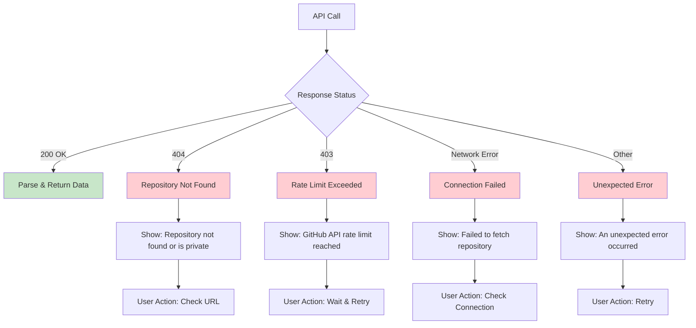
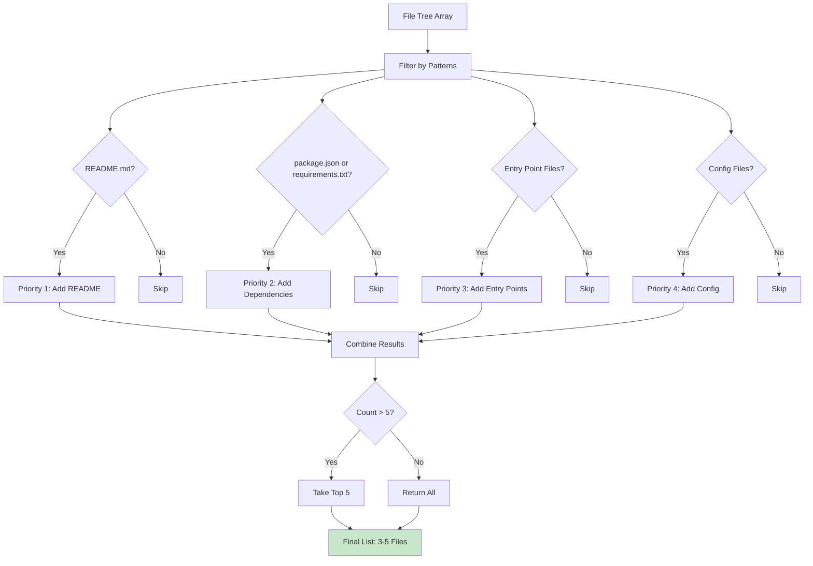

# GitHub Integration - Visual Architecture

## Component Interaction Flow



## Data Structure Flow



## State Management



## API Call Sequence



## File Structure After Implementation

```
devdock/
├── src/
│   ├── services/
│   │   └── githubService.js          ← NEW FILE
│   │       ├── parseGitHubUrl()
│   │       ├── fetchRepositoryInfo()
│   │       ├── fetchFileTree()
│   │       ├── fetchFileContent()
│   │       ├── identifyImportantFiles()
│   │       └── analyzeRepository()
│   │
│   ├── App.jsx                        ← MODIFIED
│   │   ├── + repoData state
│   │   ├── + error state
│   │   ├── + successMessage state
│   │   └── ~ handleAnalyze() - now async
│   │
│   └── components/
│       └── TabContent/
│           └── Summary.jsx            ← MODIFIED
│               └── + Display GitHub data
│
└── GITHUB_INTEGRATION_PLAN.md         ← NEW FILE (this plan)
```

## Error Handling Flow



## Important Files Detection Logic



## Summary Tab Layout (After Implementation)

```
┌─────────────────────────────────────────────────────┐
│  Summary Tab                                        │
├─────────────────────────────────────────────────────┤
│                                                     │
│  ┌─────────────────────────────────────────────┐  │
│  │ Repository Overview                         │  │
│  │                                             │  │
│  │ Name: facebook/react                        │  │
│  │ Description: A declarative, efficient...    │  │
│  │ Stars: ⭐ 234,567                           │  │
│  │ Language: JavaScript                        │  │
│  │ Total Files: 1,234 files                    │  │
│  │ GitHub URL: [View on GitHub]                │  │
│  └─────────────────────────────────────────────┘  │
│                                                     │
│  ┌─────────────────────────────────────────────┐  │
│  │ README Preview                              │  │
│  │                                             │  │
│  │ React is a JavaScript library for...       │  │
│  │ [First 500 characters]                      │  │
│  │                                             │  │
│  │ [View Full README on GitHub]                │  │
│  └─────────────────────────────────────────────┘  │
│                                                     │
│  ┌─────────────────────────────────────────────┐  │
│  │ Important Files Detected                    │  │
│  │                                             │  │
│  │ 📄 package.json                             │  │
│  │ 📄 src/index.js                             │  │
│  │ 📄 src/App.jsx                              │  │
│  │ 📄 webpack.config.js                        │  │
│  └─────────────────────────────────────────────┘  │
│                                                     │
│  ┌─────────────────────────────────────────────┐  │
│  │ Key Metrics                                 │  │
│  │                                             │  │
│  │ [Existing metrics or enhanced with real     │  │
│  │  data from GitHub API]                      │  │
│  └─────────────────────────────────────────────┘  │
│                                                     │
└─────────────────────────────────────────────────────┘
```

## Success & Error Message Display

```
┌─────────────────────────────────────────────────────┐
│  Success State                                      │
├─────────────────────────────────────────────────────┤
│                                                     │
│  ┌─────────────────────────────────────────────┐  │
│  │ ✓ Repo analyzed successfully                │  │
│  │ [Auto-hide after 3 seconds]                 │  │
│  └─────────────────────────────────────────────┘  │
│                                                     │
└─────────────────────────────────────────────────────┘

┌─────────────────────────────────────────────────────┐
│  Error State                                        │
├─────────────────────────────────────────────────────┤
│                                                     │
│  ┌─────────────────────────────────────────────┐  │
│  │ ⚠️ Repository not found or is private       │  │
│  │ [Retry Button]                              │  │
│  └─────────────────────────────────────────────┘  │
│                                                     │
└─────────────────────────────────────────────────────┘