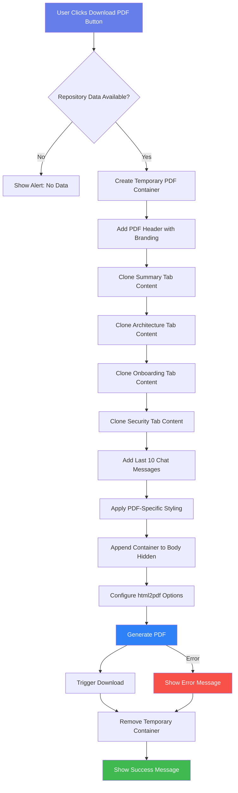
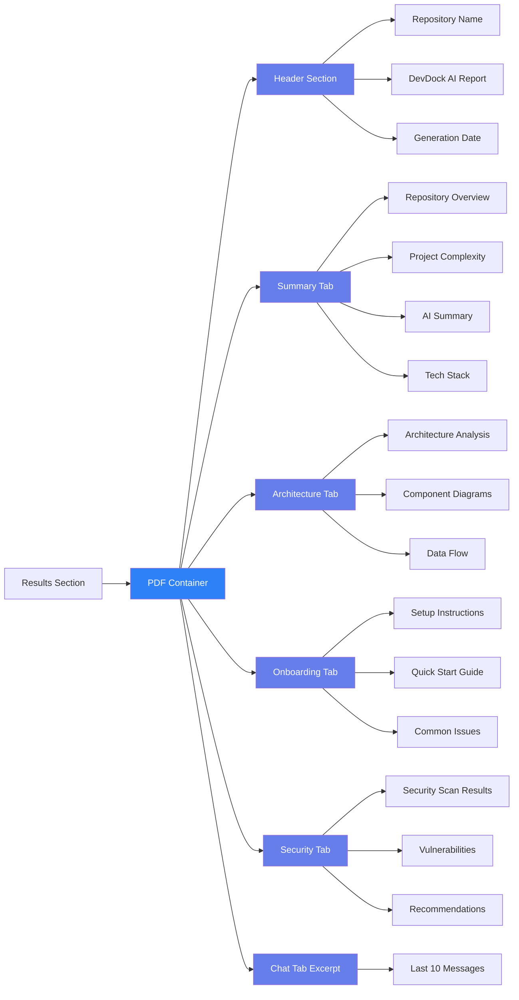
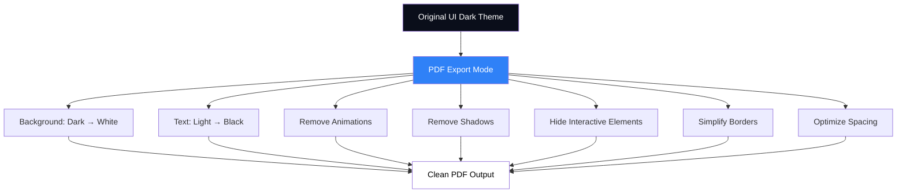
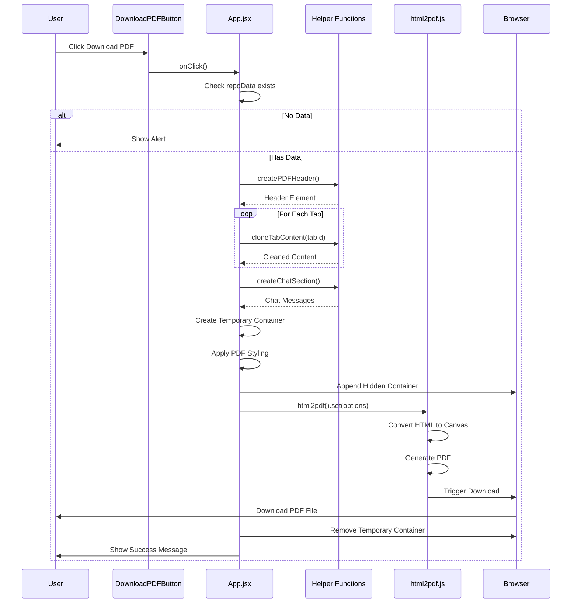
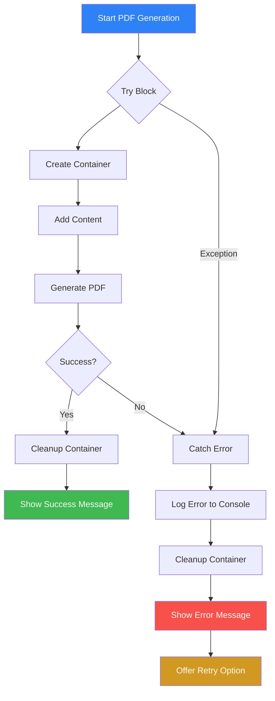

# PDF Generation Workflow Diagram

## High-Level Architecture



## Content Selection Strategy



## Styling Transformation



## Component Interaction Flow



## Error Handling Flow



## File Structure Impact

```
devdock/
├── package.json (+ html2pdf.js dependency)
├── src/
│   ├── App.jsx (enhanced handleDownloadPDF)
│   ├── App.css (+ PDF export styles)
│   └── components/
│       └── DownloadPDFButton.jsx (no changes needed)
```

## Key Implementation Points

### 1. Temporary Container Approach
- Create hidden div outside viewport
- Apply all content and styling
- Generate PDF from this container
- Remove container after generation
- **Benefit**: Original UI remains untouched

### 2. Content Cloning Strategy
- Clone each tab's rendered content
- Strip interactive elements (buttons, inputs)
- Remove animations and transitions
- Apply print-friendly styling
- **Benefit**: Clean, professional output

### 3. Multi-Page Handling
- Use CSS page-break properties
- Avoid breaking inside content cards
- Keep section headers with content
- **Benefit**: Proper pagination

### 4. Performance Optimization
- Generate PDF asynchronously
- Show loading indicator
- Handle large content gracefully
- **Benefit**: Better user experience

## Configuration Details

### html2pdf.js Options
```javascript
{
  margin: 10,                    // 10mm margins
  filename: 'DevDock_Report.pdf', // Dynamic naming
  image: {
    type: 'jpeg',                // Image format
    quality: 0.98                // High quality
  },
  html2canvas: {
    scale: 2,                    // 2x resolution
    useCORS: true,               // Handle external images
    letterRendering: true        // Better text rendering
  },
  jsPDF: {
    unit: 'mm',                  // Millimeters
    format: 'a4',                // A4 paper size
    orientation: 'portrait'      // Vertical layout
  }
}
```

## Testing Strategy

### Unit Tests
1. Test PDF header generation
2. Test content cloning functions
3. Test styling application
4. Test cleanup process

### Integration Tests
1. Test full PDF generation flow
2. Test with different repository sizes
3. Test error scenarios
4. Test browser compatibility

### Manual Tests
1. Visual inspection of PDF output
2. Verify all content is included
3. Check page breaks are appropriate
4. Confirm no UI breakage

## Success Metrics

✅ **Functionality**
- PDF generates without errors
- All content is included
- Proper formatting and layout

✅ **User Experience**
- Fast generation (< 5 seconds for typical repo)
- Clear loading indicator
- Success/error feedback

✅ **Quality**
- Professional appearance
- Readable text and code
- Proper branding

✅ **Reliability**
- No UI side effects
- Handles edge cases
- Works across browsers